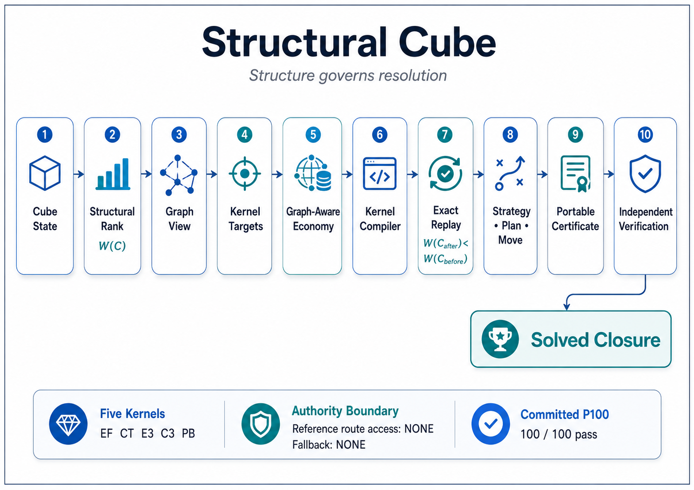

# 🧊 **Structural Cube**

## **Dependency-Governed Resolution for a 3 x 3 x 3 Cube**

### **Structure Proposes. Verification Checks. Every Action Must Descend.**


[](https://github.com/OMPSHUNYAYA/Structural-Cube/actions/workflows/structural-cube-verify.yml)

---

## 🌐 **Live Demo**

[**Launch Structural Cube**](https://ompshunyaya.github.io/Structural-Cube/demo/Structural_Cube_v1_0_2.html) — open directly in a modern browser. **No installation. No account. No external solver.**

---

**Can a cube be solved by reading its present structure rather than following a fixed layer order or accepting an opaque route first?**

Structural Cube explores that question through an interactive browser application, a graph-governed structural resolver, strict action-boundary descent, portable route certificates, and independent verification.

Its central resolution chain is:

`canonical cube state -> structural rank -> observed graph -> admitted kernel targets -> graph-aware economy selection -> exact compilation -> replay verification -> strict descent -> rebuild -> solved cube`

Its learning chain is:

`verified structural purpose -> Strategy -> Plan -> Move`

The application does not need the mixing history. It resolves the cube from the legal state it has now.

---

# 🧭 **What Structural Cube Is**

Structural Cube is a single-file browser application for mixing, exploring, learning, and resolving a standard `3 x 3 x 3` cube.

It combines:

- a native cube-state model;
- legal face, slice, and whole-cube transformations;
- canonical state extraction and legality checks;
- deterministic seeded scrambling;
- an observed obligation graph;
- a structural rank with a solved-state zero;
- five pure structural kernel contracts;
- graph-governed target selection;
- deterministic route-economy comparison;
- exact action replay;
- strict rank descent at every completed action boundary;
- simple **Strategy**, **Plan**, and **Move** guidance;
- portable SCCERT certificates;
- a standard-library Python verifier.

The main application is:

[`demo/Structural_Cube_v1_0_2.html`](demo/Structural_Cube_v1_0_2.html)

Because the HTML file is approximately `6.1 MB`, GitHub may not display it in the ordinary file view. **Download the file and open it locally in a modern browser.** It is also available through the Live Demo link above and may be attached as a downloadable repository asset.

No network connection is required during ordinary use.

---

# ⚡ **Start the Cube**

1. Download [`demo/Structural_Cube_v1_0_2.html`](demo/Structural_Cube_v1_0_2.html).
2. Open it in a current browser with JavaScript enabled. Chromium-based browsers are the tested reference environment.
3. Choose **Random** for a reproducible seeded scramble, or turn the cube manually.
4. Choose **Auto Resolve**, **With Hint**, or **Solve Myself**.
5. Open the **Technical** tab to inspect formulas and action evidence.

The interface supports:

- dragging a row or column of three squares;
- tapping a face and selecting its turn;
- rotating the view from the dark edge;
- pausing the complete guided sequence;
- requesting one move at a time;
- continuing from a different legal move without restarting.

Chromium may log a `file:` unique-origin warning when the HTML is opened locally. Structural Cube does not require an external runtime, solver, dataset, or network resource, and that warning does not by itself indicate an audit failure.

---

# 🧠 **The Structural Difference**

Many effective cube methods use:

- fixed stages;
- layer order;
- case recognition;
- memorized formulas;
- search tables;
- route optimization;
- commutators and conjugates.

Structural Cube does not reject those achievements.

It asks a different question:

> **Which unresolved structure is active now, which relations constrain it, which exact action can close part of that structure, and how can the result be verified before the next action is chosen?**

The anti-disguise law is:

`state -> structure -> action contract -> verification -> route -> lesson`

not:

`state -> route first -> structural explanation afterward`

For every admitted action, Structural Cube records:

- the canonical source state;
- the structural rank before the action;
- the selected kernel type and target;
- the graph-governed decision evidence;
- the compiled face-turn sequence;
- the exact predicted pure effect;
- the exact observed state transition;
- the rank after the action;
- the action-chain identity.

The lesson shown beside the cube is derived from checked state evidence. When a precise claim is not supported, the application uses general guidance rather than inventing a structural purpose.

---

# 📐 **Structural Rank**

The cube state is represented as:

`C = (P_e, O_e, P_c, O_c)`

where:

- `P_e` is the edge permutation;
- `O_e` is the edge orientation;
- `P_c` is the corner permutation;
- `O_c` is the corner orientation.

Legal states satisfy:

`sum(O_e) mod 2 = 0`

`sum(O_c) mod 3 = 0`

`parity(P_e) = parity(P_c)`

The structural potential is:

`Phi(C) = (rho, D_e + D_c, tau_e + tau_c, F, T)`

The integer rank is:

`W(C) = 24*rho + 4*(D_e + D_c) + tau_e + tau_c + F + T`

For the declared legal-state convention:

`0 <= W(C) <= 126`

and:

`W(C) = 0 iff C = SOLVED`

Every completed primary action must satisfy:

`W(C_(i+1)) < W(C_i)`

This provides the finite-descent basis:

`finite non-negative W + strict descent -> finite action count`

For the committed P100 routes, continued admitted-action availability, exact replay, and final-state verification establish solved closure.

---

# 🧩 **Five Pure Structural Kernels**

Structural Cube resolves structural residues through five exact kernel families:

| Kernel | Purpose |
|---|---|
| `EF(i,j)` | Correct a paired edge-orientation residue |
| `CT(i,j)` | Correct a paired corner-twist residue |
| `E3(i,j,k)` | Apply an exact three-edge permutation cycle |
| `C3(i,j,k)` | Apply an exact three-corner permutation cycle |
| `PB(i,j;k,l)` | Bridge the shared edge-corner permutation parity |

The resolver repeatedly performs:

`current state -> deterministic target -> exact pure-effect contract -> compiled face turns -> replay -> strict W descent`

The compiler is permitted to search only for the isolated pure-kernel realization. It does not read a current-state reference solution or reference distance.

`compiler_search_input = ISOLATED_PURE_KERNEL_EFFECT_ONLY`

`reference_route_access = NONE`

`current_state_reference_distance_access = NONE`

---

# 🕸️ **Graph-Governed Economy**

Structural Cube builds an observed obligation graph from the current canonical state.

The base graph uses:

`SCGS-1-D02`

At each action boundary, the primary selector:

1. enumerates exact strict-descent targets;
2. ranks them under the full observed graph;
3. retains the strongest four admitted targets;
4. compares deterministic continuations to depth four;
5. selects the lowest declared compiled face-turn cost;
6. replays and verifies the complete chosen action.

The primary authority is:

`GRAPH_GOVERNED_ECONOMY_PRIMARY_AUTHORITY`

The economy policy is:

`TOP_4_GRAPH_POOL_DEPTH_4`

The route authority is:

`REFERENCE_FREE_STRUCTURAL_KERNEL_AUTHORITY`

The graph is a declared observed structural model. It is not claimed as the only possible mathematical dependency graph for cube solving.

---

# 🎓 **Strategy, Plan, and Move**

The guided interface separates three questions:

## **Strategy**

**What larger structural goal is being pursued?**

## **Plan**

**Why does the next action belong to that goal?**

## **Move**

**Which turn should be carried out now?**

The learning law is:

`verified purpose -> Strategy -> Plan -> Move`

Technical formulas and certificates remain in a separate tab so the main guidance can stay readable for learners.

---

# ✅ **Validated Version Status**

Structural Cube v1.0.2 was evaluated on the committed `P100` corpus:

`seed_set = 1..100`

`scramble_length = 22`

`generator = xorshift32`

Route-economy rows compare against the declared earlier full-graph selector, whose P100 mean was `193.99` moves. The baseline and comparison method are documented in the [Corpus, Telemetry, and Resolver Improvement Specification](docs/specifications/Structural_Cube_Corpus_Telemetry_and_Resolver_Improvement_Specification_v1_0_2.txt).

| Property | Result |
|---|---:|
| Version | **1.0.2** |
| Committed starting states | **100** |
| States solved | **100/100** |
| Strict `W` descent | **PASS** |
| Final `W = 0` | **100/100** |
| Reference-route access | **NONE** |
| Current-state reference-distance access | **NONE** |
| Fallback activation | **NONE** |
| Seeds improved against the declared earlier full-graph selector | **100** |
| Seeds equal | **0** |
| Seeds regressed | **0** |
| Baseline mean moves | **193.99** |
| Graph-aware economy mean moves | **174.58** |
| Median moves | **172** |
| `p95` moves | **207** |
| Maximum moves | **223** |
| Total moves saved across P100 | **1,941** |
| Portable certificates produced | **100** |
| Browser certificate verification | **100/100 PASS** |
| Independent Python verification | **100/100 PASS** |
| Tamper rejection | **PASS** |
| Realization catalogue entries | **2,292** |
| Wall-clock authority | **NONE** |

Runtime measurements are operational information only.

`wall_clock_authority = NONE`

The producer run recorded approximately `52 seconds` on one tested machine. Independent verification normally takes roughly one minute, depending on processor, storage, operating system, and Python build.

---

# 🧾 **Portable Certificate Evidence**

The certificate profile is:

`SCCERT-1-D02-EXP-A`

Each certificate binds:

- source state and source-state hash;
- source structural rank;
- graph view and graph-governed target selection;
- exact kernel target and contract;
- compiled face-turn algorithm;
- realization catalogue entry;
- exact action replay;
- target state and target-state hash;
- rank before and after;
- strict descent;
- action-chain continuity;
- final solved state;
- certificate root.

The P100 bundle is:

[`outputs/Structural_Cube_v1_0_2_Certificate_Bundle.json`](outputs/Structural_Cube_v1_0_2_Certificate_Bundle.json)

The corresponding certificate manifest is:

[`outputs/Structural_Cube_v1_0_2_Certificate_Manifest.txt`](outputs/Structural_Cube_v1_0_2_Certificate_Manifest.txt)

The browser producer report is:

[`outputs/Structural_Cube_v1_0_2_Producer_Verification_Report.json`](outputs/Structural_Cube_v1_0_2_Producer_Verification_Report.json)

The independent verification report is:

[`outputs/Structural_Cube_v1_0_2_Independent_Verification_Report.json`](outputs/Structural_Cube_v1_0_2_Independent_Verification_Report.json)

---

# 🔍 **Independent Verification**

## **Requirement**

- Python **3.9 or later**
- Python standard library only
- no network connection
- no third-party Python package

From the repository root, run:

```bash
python verify/Structural_Cube_v1_0_2_Verifier.py outputs/Structural_Cube_v1_0_2_Certificate_Bundle.json --json-report Structural_Cube_v1_0_2_Local_Verification_Report.json
```

On systems where the command is named `python3`:

```bash
python3 verify/Structural_Cube_v1_0_2_Verifier.py outputs/Structural_Cube_v1_0_2_Certificate_Bundle.json --json-report Structural_Cube_v1_0_2_Local_Verification_Report.json
```

Expected principal result:

```text
status = PASS
failure_count = 0
certificate_count = 100
passed_certificate_count = 100
failed_certificate_count = 0
```

Expected exit code:

`0`

The verifier independently reconstructs:

- cube-turn permutations;
- canonical facelet states;
- cubie extraction and legality;
- structural-rank values;
- SCGS graph views;
- graph scores and target pools;
- depth-four economy decisions;
- pure-kernel effects;
- compiled action transitions;
- action and certificate chains;
- aggregate and bundle roots;
- final solved states.

The verifier retains earlier D01 constants for compatibility. The active v1.0.2 path verifies the `SCCERT-1-D02-EXP-A` graph-aware economy bundle.

Detailed instructions are provided in:

[`verify/VERIFY.md`](verify/VERIFY.md)

---

# 🔐 **Application Checksum and Evidence Roots**

The manually maintained checksum file covers only the browser application:

`verify/SHA256SUMS.txt`

```text
f039ae4f14ac041b14bf04e79bf0a4d476bdcf86ab9fcb0c8d3c5fb1ae81e1ab  demo/Structural_Cube_v1_0_2.html
```

This checksum confirms the identity of the exact browser application file.

`matching HTML checksum = matching browser-application identity`

It does not by itself verify the certificate bundle or the complete evidence chain.

Important evidence roots:

| Identity | SHA-256 |
|---|---|
| Version report canonical root | `eb911576bbfbb7dd8ce6f9293ba81f361bce112f30450ead9d7c69ea0fc69225` |
| Version manifest root | `74a6b3f92de7fe8e9d42ea5ee05ba7e54908ff2cdcbfcec31c3312f6d8e64ea2` |
| Source corpus manifest hash | `9c19312da2dc9832630b78f26ff305c82e7b26e8d93257c1143de649e7404bdd` |
| Realization catalogue root | `e4171e3dbfe128041ac8498b97d5729764de9a52b23e58135f14676431d66ac4` |
| Certificate aggregate root | `d4487b83847f17d89e433d6bde768a7000602f918857f1b3040f8f47bc2bc472` |
| Certificate bundle root | `c9433aa2070d3a0f23b2df78b386c7e425dcb2382455befb72494793d6ca62a7` |

Version evidence:

- [`outputs/Structural_Cube_v1_0_2_Manifest.txt`](outputs/Structural_Cube_v1_0_2_Manifest.txt)
- [`outputs/Structural_Cube_v1_0_2_Report.json`](outputs/Structural_Cube_v1_0_2_Report.json)
- [`verify/SHA256SUMS.txt`](verify/SHA256SUMS.txt)

The checksum file is intentionally limited to the browser application. The version manifest, version report, certificate bundle, and independent verifier preserve the deeper evidence chain.

Distinguish:

`browser-application SHA-256 != complete certificate verification`

and:

`raw file SHA-256 != canonical root in every format`

---

# 🏗️ **Evidence Architecture**

The evidence path is deliberately separated:

`browser application -> producer certificates -> portable bundle -> independent verifier -> version manifest -> version report`

Each layer has a distinct responsibility.

## **Browser application**

Produces graph-aware economy routes and SCCERT certificates.

## **Producer verification**

Checks certificate construction, roots, expected identities, and tamper rejection in the browser environment.

## **Portable bundle**

Carries the committed source states, realization catalogue, 100 certificates, certificate manifest, summary, authority declarations, and bundle root.

## **Independent verifier**

Reconstructs the declared mathematics and route decisions without calling the browser resolver.

## **Version manifest**

Binds the browser application, certificate bundle, certificate manifest, producer verification report, independent verifier, and independent verification report by SHA-256.

## **Version report**

Binds the manifest root, producer result, independent result, authority declarations, artifact identities, and claim boundary.

---

# 🧭 **Architecture at a Glance**



---

# 📚 **Documentation**

Reader guides:

- [Quickstart](docs/QUICKSTART.md)
- [FAQ](docs/FAQ.md)
- [Architecture](docs/ARCHITECTURE.md)
- [Evidence and Verification](docs/EVIDENCE_AND_VERIFICATION.md)
- [Claim Boundary](docs/CLAIM_BOUNDARY.md)
- [Verification Procedure](verify/VERIFY.md)
- [Architecture Diagram](docs/Structural_Cube_Architecture_Diagram_v1_0_2.png)

Technical specifications:

- [Resolver Architecture and Deployment Direction](docs/specifications/Structural_Cube_Resolver_Architecture_and_Deployment_Direction_v1_0_2.txt)
- [Corpus, Telemetry, and Resolver Improvement Specification](docs/specifications/Structural_Cube_Corpus_Telemetry_and_Resolver_Improvement_Specification_v1_0_2.txt)
- [SCGS-1-D02 Canonical Graph Serialization Conformance Specification](docs/specifications/SCGS-1-D02_Canonical_Graph_Serialization_Conformance_Specification_v0_2_5.txt)

---

# 🔥 **Challenge Structural Cube**

Reviewers are encouraged to inspect, replay, mutate, and attempt to falsify the documented guarantees.

Useful falsification targets include:

- same canonical source state -> different selected graph-aware route;
- accepted action -> exact pure-kernel effect does not match;
- accepted action -> `W_after >= W_before`;
- certificate target -> deterministic target selector disagrees;
- compiled algorithm -> target state does not match;
- certificate chain -> broken predecessor identity accepted;
- manifest entry -> certificate root mismatch accepted;
- modified bundle -> bundle root still accepted;
- nonzero fallback -> authority audit still passes;
- current-state reference-route access -> authority audit still passes;
- current-state reference-distance access -> authority audit still passes;
- failed certificate -> aggregate P100 status still passes;
- non-solved final state -> certificate still passes.

Primary falsification relation:

`invalid structural transition -> valid SCCERT certificate`

A reproducible prohibited outcome should be documented and used to correct the implementation, strengthen verification, or narrow the stated guarantee.

---

# ⚠️ **Scope and Boundaries**

Structural Cube v1.0.2 establishes, for the committed P100 corpus:

- deterministic graph-governed structural selection;
- strict rank descent at every action boundary;
- solved closure for all 100 states;
- zero current-state reference-route access;
- zero current-state reference-distance access;
- zero fallback activation;
- graph-aware route-economy improvement on every tested seed;
- portable certificate generation;
- browser verification;
- independent Python verification;
- tamper rejection;
- reproducible SHA-256 identities.

Structural Cube does **not** claim:

- shortest-route optimality;
- competition-speed superiority;
- universal totality over every legal cube state;
- superiority over every established cube method;
- a new mathematical ownership claim over standard cube transformations;
- independent institutional or standards certification;
- safety-critical qualification;
- physical cube recognition through a camera;
- measured learner-outcome superiority;
- support for every twisty puzzle.

The current version class is:

`EXPERIMENTAL`

The declared corpus boundary is:

`COMMITTED_P100`

---

# 🖥️ **Requirements**

For the browser application:

- a modern browser with JavaScript enabled;
- approximately `6.1 MB` of local storage for the HTML file;
- no network connection required;
- no browser extension required;
- no third-party solver required.

For independent verification:

- Python **3.9+**;
- approximately `11 MB` for the certificate bundle;
- standard library only;
- normally about one minute of execution time.

Administrator rights are not required.

---

# 📜 **License**

See: [LICENSE](LICENSE)

The Structural Cube reference implementation and associated verification artifacts are free to use, copy, modify, test, study, and redistribute without a license fee, subject to the license terms stated in the repository.

Documentation, architecture materials, specifications, diagrams, and explanatory content are subject to the separate terms stated in the LICENSE.

This repository does not claim recognition as a formal technical standard, security certification, production qualification, or third-party verification.

---

# 🌱 **Shunyaya Framework**

Structural Cube is part of the Shunyaya Framework.

Its central architectural principle is:

`structure can carry correctness evidence without changing the classical object being resolved`

For Structural Cube:

`classical cube state remains the cube state`

What changes is the visibility of:

- obligations;
- dependencies;
- structural rank;
- action authority;
- exact transition evidence;
- route identity;
- certificate identity;
- learning purpose.

---

# 🧠 **Core Observation**

A legal turn is not automatically a useful structural action.

A route is not automatically an explanation.

An explanation is not automatically evidence.

Structural Cube therefore requires:

`legal action + declared target + exact effect + strict descent + replay identity`

The result is a cube application in which resolution, verification, and learning are derived from the same declared structural process.

---

# 🌍 **Potential Beyond the Cube**

Structural Cube demonstrates a reusable structural pattern:

`current state -> visible obligations -> admitted action -> exact replay -> verified progress -> evidence`

This pattern may inform future work in:

- robotics and controlled movement;
- manufacturing and assembly;
- software workflows and recovery;
- infrastructure inspection and repair;
- AI planning and tool execution;
- education, training, and other puzzles;
- auditable decision and settlement systems.

These are **potential application directions**, not validated deployments of Structural Cube v1.0.2.

---

# 🌌 **Final Insight**

A cube can move in many legal ways.

The deeper question is whether every accepted movement belongs to a visible, verifiable path of structural closure.

Structural Cube answers that question through:

`state -> structure -> action -> evidence -> descent -> solved state`

**The cube moves locally. The structure closes globally.**

